# Orrery — working models of ideas

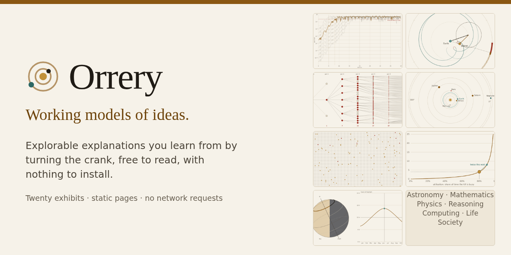

Orrery is a small studio that makes **explorable explanations**: web pages where you learn how
something works by changing it and watching what happens. An orrery is a clockwork model of the
solar system; it doesn't tell you the planets move, it lets you turn the crank and see. Every
exhibit here works the same way.

**Visit it: <https://itayco2.github.io/orrery/>**

## The exhibits

Twenty exhibits are published. Each one is a single page with several interactive figures; each
says plainly what its model leaves out and ends with its sources, and works offline, with a
keyboard and on a phone.

| | Exhibit |
|---|---|
| 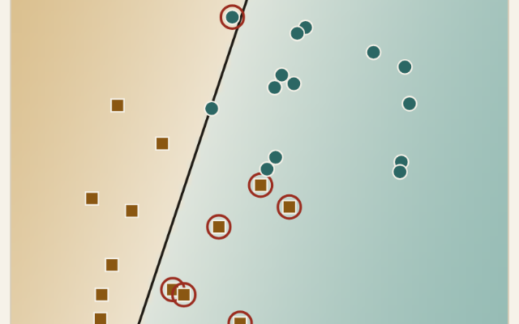 | **[How does a machine learn from examples?](https://itayco2.github.io/orrery/models/neural-net/)** · Computing *Nobody writes the rules into a neural network. So where do they come from?* Set one artificial neuron by hand, walk gradient descent downhill (and break it with too big a step), then watch a tiny network trained live in your browser bend its boundary around XOR, a circle or two moons. |
| 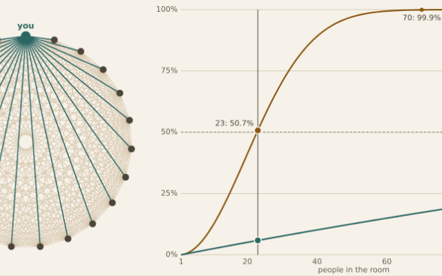 | **[Why do two people in 23 probably share a birthday?](https://itayco2.github.io/orrery/models/birthday/)** · Mathematics *In a room of 23 people, a shared birthday is more likely than not. Why do so many people guess far lower?* Fill rooms with random birthdays, count the pairs, and follow the same arithmetic to why a 128-bit hash gives only about 64 bits of protection against collisions. |
| 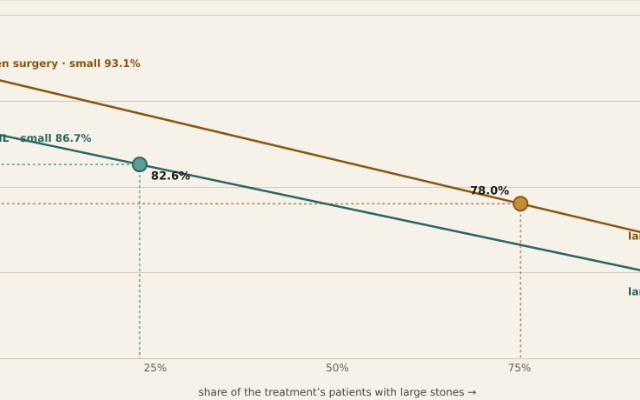 | **[Better in every group, worse overall?](https://itayco2.github.io/orrery/models/simpson/)** · Reasoning *How can a treatment win for small kidney stones and for large ones, yet lose overall?* Simpson's paradox: make it happen with your own numbers, see it in real kidney-stone data, and understand it as unequal weights — then decide which number to trust. |
| 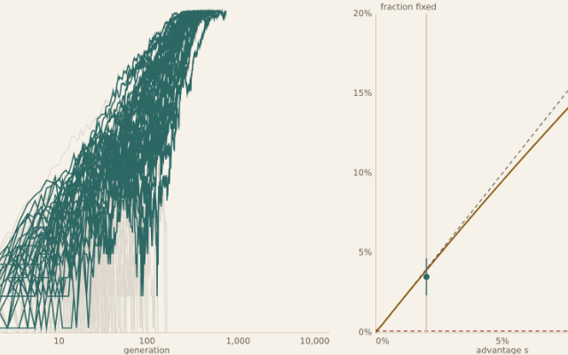 | **[Does a better gene always win?](https://itayco2.github.io/orrery/models/selection/)** · Life *A new mutation that helps its carriers should spread. Why do most of them vanish?* Run a thousand populations and watch chance (genetic drift) erase most beneficial mutations: a 1% advantage wins only about 2% of the time, and in small populations even harmful variants can take over. |
| 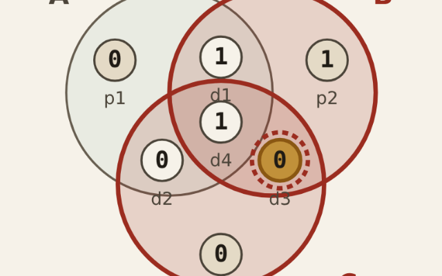 | **[How does a scratched CD still play?](https://itayco2.github.io/orrery/models/error-correction/)** · Computing *A scratch wipes out thousands of bits at once. Why doesn't the music stop?* Flip bits in Hamming's three-circle code and watch the failed checks point at the culprit, then drag a scratch across a stored picture and see how shuffling the bits lets every error be fixed. |
| 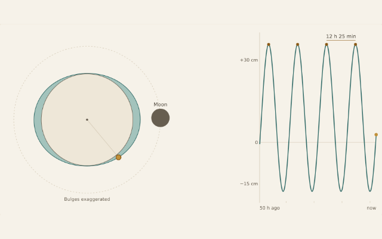 | **[Why are there two tides a day?](https://itayco2.github.io/orrery/models/tides/)** · Astronomy *The Moon pulls the sea towards it — so why is there a high tide on the far side too?* The tide is the difference in the Moon’s pull across the Earth: a stretch both ways along the Earth–Moon line that fades as 1/d³. Turn the Earth under its two bulges, and add the Sun to get spring and neap tides. |
| 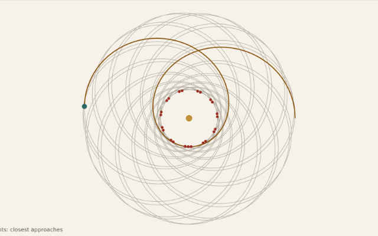 | **[Why doesn’t the Moon fall down?](https://itayco2.github.io/orrery/models/orbits/)** · Physics *It does fall, all the time. It just keeps missing the Earth.* Fire Newton’s cannon faster and faster until the ball orbits or escapes, launch a planet onto a Kepler ellipse, check Kepler’s third law against the real planets, and change the law of gravity to see why only the inverse square closes the orbit. |
| 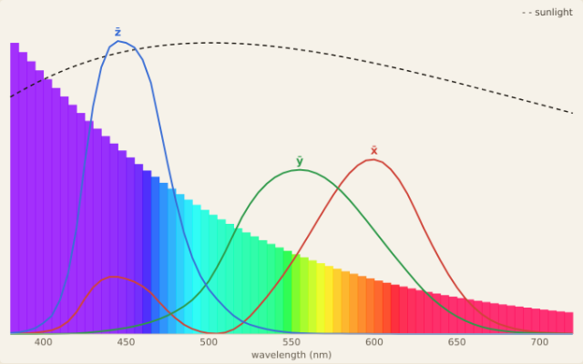 | **[Why is the sky blue and the sunset red?](https://itayco2.github.io/orrery/models/sky-colour/)** · Physics *Air is transparent and sunlight is white. So where do the blue sky and the red sunset come from?* Air molecules scatter blue light about six times more strongly than red. Send light through a box of air, lower the Sun to the horizon through up to 38 atmospheres, and see why the sky isn't violet and clouds are white. |
| 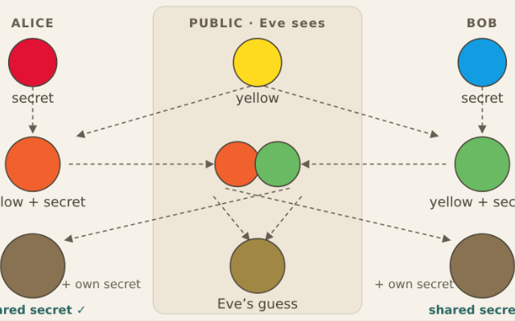 | **[How can two strangers agree on a secret in public?](https://itayco2.github.io/orrery/models/key-exchange/)** · Computing *Two machines that have never met agree on a secret while anyone can listen. How?* Diffie–Hellman key exchange, first with paint and then with arithmetic on a clock: perform the exchange with small numbers, watch an eavesdropper search, and see why each extra bit doubles her work. |
| 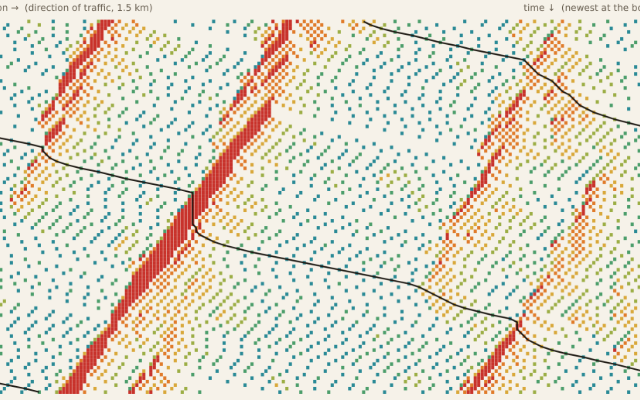 | **[Where do traffic jams come from when nothing’s wrong?](https://itayco2.github.io/orrery/models/traffic/)** · Society *No crash, no roadworks, no merge — and still you crawl. How do drivers make a jam out of nothing, and why does it travel backwards?* A ring road of simulated drivers (the Nagel–Schreckenberg model) grows phantom jams from tiny hesitations. Watch them drift upstream at motorway-like speeds, and find the density above which more cars carry less traffic. |
| 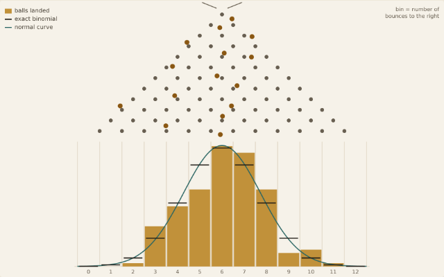 | **[Why do bell curves show up everywhere?](https://itayco2.github.io/orrery/models/galton/)** · Mathematics *Heights, errors and test scores all make the same hump. Why — and when don't they?* A Galton board, sums of dice of any shape, and growth that multiplies: the central limit theorem, and the two ways the bell curve fails. |
| 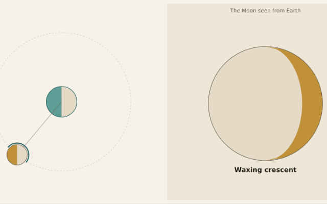 | **[Why does the Moon have phases?](https://itayco2.github.io/orrery/models/moon-phases/)** · Astronomy *It isn't Earth's shadow. Drag the Moon round its orbit and see what is really going on.* Half the Moon is always lit; the phase is how much of that half faces us. Test the shadow explanation, see why eclipses come in seasons (with a real ephemeris that finds 2026's four eclipses), and why we always see the same face. |
| 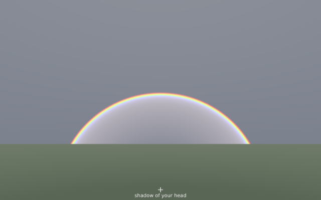 | **[Why is a rainbow round?](https://itayco2.github.io/orrery/models/rainbow/)** · Physics *You can never walk to a rainbow, and the person beside you sees a different one. What is it, and why is it always part of a circle?* Trace sunlight through a raindrop: the exit angles pile up at about 42° from the shadow of your head, so the drops that flash at you lie on a cone around your eye. Water bends violet more than red, which spreads the colours, and the Sun's height decides how much of the circle is above the ground. |
| 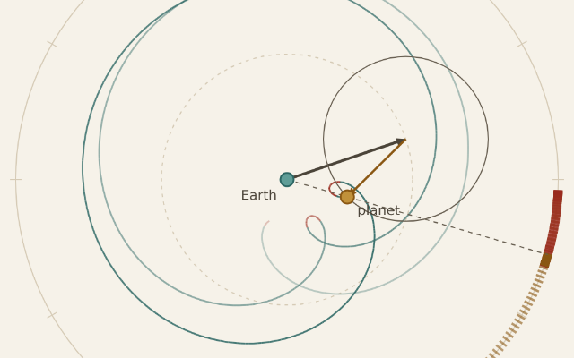 | **[Can circles draw anything?](https://itayco2.github.io/orrery/models/epicycles/)** · Mathematics *Why does Mars sometimes go backwards — and can circles on circles trace any shape?* Arrows spinning on arrows: Ptolemy's epicycles reproduce Mars's backward loops, and with enough of them — a Fourier series — they redraw any closed shape, including one you draw. |
| 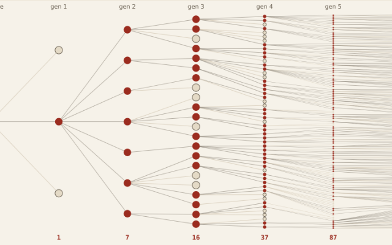 | **[How many people need to be immune?](https://itayco2.github.io/orrery/models/herd-immunity/)** · Life *Why does measles need about 95% vaccinated, when other infections need far less?* Chains of infection, an SIR epidemic, overshoot and vaccine coverage, all from one idea: an outbreak grows only while each case causes more than one new case. The threshold is 1 − 1/R0. |
| 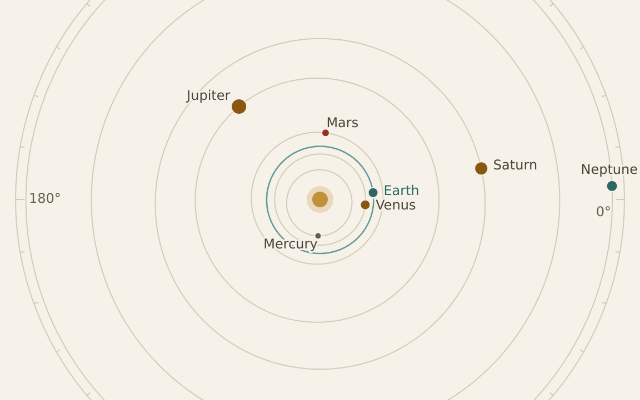 | **[Where are the planets tonight?](https://itayco2.github.io/orrery/models/orrery/)** · Astronomy *The planets are somewhere specific right now. Where, and why do they sometimes seem to run backwards?* A working model of the solar system at today's date, from JPL's orbital elements: turn the crank to see where each planet is, watch Mars loop backwards as Earth overtakes it in 2027, and see why the outer planets are so slow. |
| 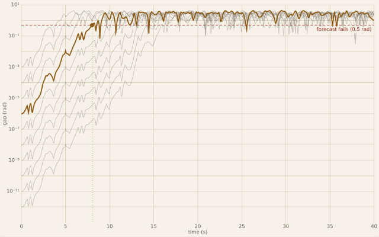 | **[Why can’t we forecast the weather a month ahead?](https://itayco2.github.io/orrery/models/chaos/)** · Physics *Two pendulums started a millionth of a radian apart soon do completely different things. Why doesn’t exact physics mean exact forecasts?* A double pendulum obeys Newton’s laws with no randomness, yet tiny differences in its start grow exponentially, so each tenfold gain in precision buys only a fixed extra stretch of forecast. The atmosphere behaves the same way, which is why day-to-day forecasts are useful for about ten days today and can never reach much beyond two weeks. |
| 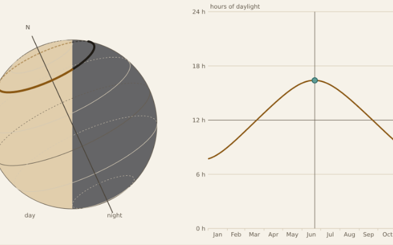 | **[Why is summer warm?](https://itayco2.github.io/orrery/models/seasons/)** · Astronomy *Earth is closest to the Sun in January. So why is July the warm month in the north?* Drag Earth round its orbit drawn to scale, tilt a beam of sunlight, and watch the day and night line cross a tilted globe, then switch off the tilt or the orbit's stretch to see which one makes the seasons. |
| 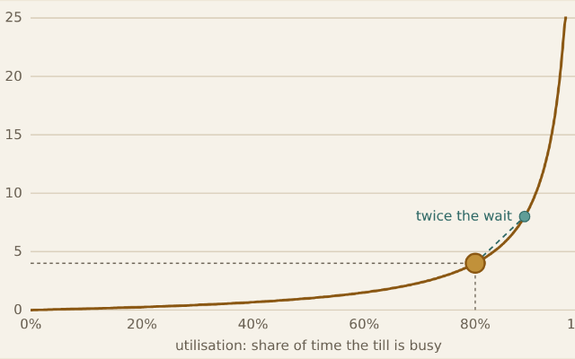 | **[Why is the other line always faster?](https://itayco2.github.io/orrery/models/queues/)** · Society *A checkout busy 80% of the time already has a queue. Why do waits explode near full capacity — and why is your line so rarely the fast one?* Simulated checkouts show how randomness alone creates queues, why the wait explodes as a till nears 100% busy, why one shared line beats three separate ones, and why variability matters as much as the average. |
| 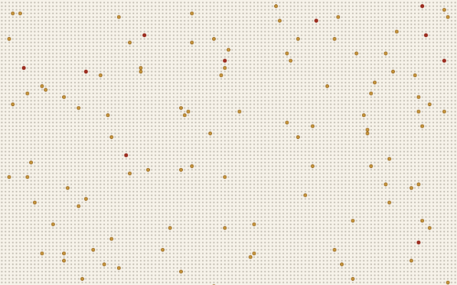 | **[You tested positive. Now what?](https://itayco2.github.io/orrery/models/positive-test/)** · Reasoning *A 99%-accurate test says you have a rare disease. Why is the chance you're sick only about 9%?* Count the people in a town of 10,000 to see why most positive results for a rare disease are false alarms, how who gets tested changes the answer, and what a second test does — Bayes' rule in odds form. |

## Use it offline

This repository *is* the site: plain HTML, CSS and JavaScript, with no build step, no dependencies
and no network requests (no CDNs, web fonts, analytics or remote images).

- **Online:** <https://itayco2.github.io/orrery/>
- **Offline:** [download the ZIP](https://github.com/itayco2/orrery/archive/refs/heads/main.zip) (or *Code → Download ZIP*), unzip it and open
  `index.html` in a browser. The pages work straight from the file system.
- **With any static server:** for example `python3 -m http.server 8000` in the unzipped folder,
  then visit <http://localhost:8000/>.

The front door is [`index.html`](index.html), the gallery of exhibits;
[`about/`](about/index.html) explains what Orrery is.

## Corrections

If you find a mistake (a wrong number, a broken control, a claim that goes too far), please
[open an issue](https://github.com/itayco2/orrery/issues) and name the exhibit. Known-false claims are fixed or withdrawn.

## Licence

- **Code** (HTML structure, CSS and JavaScript): **MIT**, see [`LICENSE`](LICENSE).
- **Text and figures** (the exhibits' words and pictures): **CC BY-NC 4.0**, see
  [`LICENSE-CONTENT.md`](LICENSE-CONTENT.md). Use them for learning and teaching, with credit to
  Orrery; don't resell them.
- Third-party code and the data the models rely on are listed in [`THIRD-PARTY.md`](THIRD-PARTY.md).
